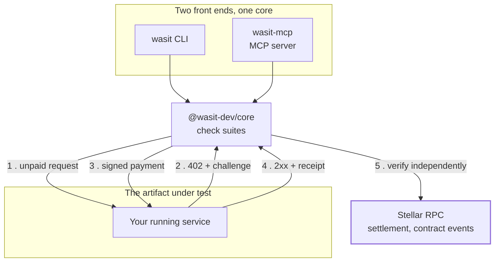

<div align="center">


# Wasit

**Protocol-compliance testing for x402 and MPP on Stellar.**

Wasit runs the real payment flow against a live service, not a mock of it, and
it is not a schema validator: a response can have every field in the right place
and still take money without settling it. Settlement is verified on-chain — from
the token contract's own transfer event rather than the service's own response —
for MPP charge mode today. Extending that to the x402 payment checks is tracked
for 0.5.0; until then they exercise the real flow and judge the target on its
HTTP behaviour.

[](https://github.com/wasit-dev/wasit/actions/workflows/ci.yml)
[](https://stellar.org)
[](https://x402.org)
[](https://paymentauth.org)
[](https://modelcontextprotocol.io)
[](https://www.typescriptlang.org)

[Website](https://usewasit.dev) ·
[Check Catalogue](docs/CHECKS.md) ·
[CLI Guide](docs/guides/cli.md) ·
[MCP Guide](docs/guides/mcp.md) ·
[Configuration](docs/guides/configuration.md) ·
[Design Notes](#design-notes)

</div>

---

## Table of Contents

- [How It Works](#how-it-works)
- [Who You May Point It At](#who-you-may-point-it-at)
- [What a Passing Result Means](#what-a-passing-result-means)
- [The Problem](#the-problem)
- [Status](#status)
- [Install](#install)
- [Building from source](#building-from-source)
- [Trying It](#trying-it)
- [Design Notes](#design-notes)
- [Roadmap](#roadmap)

---

## How It Works

Wasit talks to two things: the service under test, over HTTP, and the Stellar
network, over RPC. It never trusts the first about what happened on the second.



Step 5 is the point of the tool. The challenge in step 2 states what the service
wants paid; the receipt in step 4 states what it claims happened. Wasit compares
both against what the chain actually recorded — including the token contract's
own transfer event, not just the transaction it was asked to make.

The CLI and the MCP server are thin adapters over the same suite functions. They
cannot disagree about the same target, because there is only one implementation
of each check.

---

## Who You May Point It At

Wasit settles real payments and can permanently close a payment channel, so
pointing it at a service is an action taken against someone else's system.
**Testing any target outside your own control requires the operator's explicit
written authorization.** That is a rule binding on the builder and on every user
of the tool, not a feature of the software: no tool can work out from a URL
alone who owns the service behind it.

Two guards follow from that rather than replace it. The destructive check does
not run at all without an explicit opt-in, and in the MCP server the destructive
tool is not even registered unless a person started the process intending it to
exist. Everything else is on the operator running the tool.
[SECURITY.md](SECURITY.md) states the full policy, including how keys are
handled and how findings about someone else's service are disclosed.

---

## What a Passing Result Means

A passing run means one thing: at the moment of the run, against the target
given, the service implemented the checked clauses of the x402/MPP specs
correctly, and the settlements it claimed were confirmed on-chain — against the
spec and SDK versions the report names.

It is not a security assessment, not an audit, and not a statement about the
safety of the contracts a service settles through, its key management, its
infrastructure, or its business logic. No source is read and no bytecode is
analysed. That is a different artifact under test, and it belongs to dedicated
tooling — Scout, the Certora Sunbeam Prover, Komet, OpenZeppelin's Soroban
detectors — which Wasit is built to run alongside rather than replace.

Only the target URL given was tested. Only clauses with a catalogue entry were
checked; every entry traces to a written clause, and clauses without one are
simply not covered yet. A service can also regress after passing. The full
boundary is in [docs/design/scope-boundary.md](docs/design/scope-boundary.md).

---

## The Problem

x402 and MPP have an official SDK. They have no independent protocol-compliance tester.

`stellar-anchor-tests` fills that role for the anchor ecosystem: an anchor
operator points it at their deployment and gets an answer about whether their
service actually implements the protocol. Nothing equivalent exists for the
agentic-payments stack, so "we support x402" is currently a claim nobody can
check.

That gap is not theoretical. Three concrete divergences turned up while building
this tool, all against official, current packages:

**The payment header has two names.** Stellar's own documentation uses
`PAYMENT-REQUIRED` in one place and `X-Payment` in another. A client written
from one page will not find the header emitted by a server written from the
other. `X402-02` deliberately accepts either, because refusing one would mean
failing services that followed official documentation — but a service cannot
know which convention its callers expect. This is a documentation defect
upstream, and it is exactly the kind of thing a protocol-compliance tester exists to
surface.

**A whole error taxonomy is unreachable.** In MPP channel mode, every rejection
— replay, non-monotonic commitment, bad signature, a channel already settling —
returns an identical HTTP 402 body. The SDK defines precise error types for each
of these and none are reachable, because of a class-hierarchy mismatch between
two packages. An operator debugging a rejected payment cannot tell which rule
they broke. See [docs/CHECKS.md](docs/CHECKS.md#note-on-error-granularity-week-2)
and the full write-up in [docs/findings/upstream-sdk.md](docs/findings/upstream-sdk.md).
Filed upstream as [stellar-mpp-sdk#66](https://github.com/stellar/stellar-mpp-sdk/issues/66);
independently confirmed by [RouteDock's fix](https://github.com/winsznx/routedock/pull/241)
for the same defect.

**A parameter named for one thing does another.** `feePayer.envelopeSigner`
reads like the account paying transaction fees. It is actually the account
providing authorisation, and the channel contract requires different accounts
for different operations. Getting it wrong produces a transaction that reaches
the chain and fails there, surfaced by the SDK as `[object Object]`. Filed
upstream as [stellar-mpp-sdk#67](https://github.com/stellar/stellar-mpp-sdk/issues/67).

Wasit exists so these are found by a tool, before they are found by a user.

---

## Status

| Area                                   | Status                                                                                                                                                                                                       |
| -------------------------------------- | ------------------------------------------------------------------------------------------------------------------------------------------------------------------------------------------------------------ |
| x402 read-only checks (`X402-01`–`05`) | Done, verified against a real facilitator                                                                                                                                                                    |
| x402 payment checks (`X402-06`, `07`)  | Done, settles on testnet                                                                                                                                                                                     |
| MPP charge mode (`MPP-01`)             | Done, settlement verified from contract events                                                                                                                                                               |
| MPP channel mode (`MPP-10`–`14`)       | Done, including destructive close                                                                                                                                                                            |
| CLI                                    | Done — five subcommands plus an interactive dashboard                                                                                                                                                        |
| Testnet wallet tooling                 | Done — `wasit wallet` create/fund/status, testnet only                                                                                                                                                       |
| MCP server                             | Done, three tools + one behind an opt-in                                                                                                                                                                     |
| Error taxonomy and exit codes          | Done                                                                                                                                                                                                         |
| Wasit's own test suite                 | Done — offline (no keys, no target, no network); type-check and tests both run in CI                                                                                                                          |
| Testing against third-party services   | Partial — 3 public repos tested without contacting the operator (see [evidence](docs/evidence/2026-08-15-third-party-run.md)); a run with explicit operator authorization hasn't happened yet                |
| Upstream reports to SDK maintainers    | Filed — [stellar-mpp-sdk#66](https://github.com/stellar/stellar-mpp-sdk/issues/66), [#67](https://github.com/stellar/stellar-mpp-sdk/issues/67), [#70](https://github.com/stellar/stellar-mpp-sdk/issues/70) (fix in review as [PR #74](https://github.com/stellar/stellar-mpp-sdk/pull/74)) |
| Published to npm                       | Yes — `@wasit-dev/core`, `@wasit-dev/cli`, `@wasit-dev/server`                                                                                                                                               |
| Mainnet                                | Out of scope — see [Design Notes](#design-notes)                                                                                                                                                             |

Thirteen checks are implemented and reachable from both front ends. Every one is
traced to a written spec clause in [docs/CHECKS.md](docs/CHECKS.md); a check that
cannot be traced is out of scope by construction.

---

## Install

Requires Node.js `>=24`.

```bash
# run it once, no install
npx @wasit-dev/cli test --target https://your-service.example/paid --read-only

# or keep it around
npm install -g @wasit-dev/cli
wasit test --target https://your-service.example/paid --read-only
```

That runs `X402-01` through `X402-05` against your own service. It costs
nothing, needs no keys, and settles no transaction. `wasit checks` lists every
check the tool can run, and `--json` on any run gives machine-readable output.

Running `wasit` with no arguments in a terminal opens an interactive dashboard
— the same checks, plus a check catalogue browser and a testnet wallet screen,
driven by arrow keys. Piped or in CI it prints help instead, so nothing that
scripts Wasit today changes behaviour. `wasit wallet create|fund|status`
is the same wallet tooling as plain subcommands: it generates testnet keys,
funds them through Friendbot, and opens a USDC trustline. Both are covered in
[docs/guides/cli.md](docs/guides/cli.md).

The checks that settle a real testnet payment — `X402-06`, `X402-07`, `MPP-01`,
and the channel suite — need a funded testnet account.
[docs/guides/configuration.md](docs/guides/configuration.md) explains each value
and where to get it. For the MCP server, see
[docs/guides/mcp.md](docs/guides/mcp.md).

## Building from source

Only needed to change Wasit itself, or to run the bundled fixture servers below.
Developed and verified on Node **v24.18.0**.

```bash
git clone https://github.com/wasit-dev/wasit.git
cd wasit
npm install
npm run build
cp .env.example .env
```

Before publishing, verify the packages as a user receives them rather than as
the repo builds them:

```bash
npm run verify:clean-install
```

A checkout deduplicates one dependency graph across all three workspaces; a
clean install resolves each package's own declared ranges and can nest a second
copy of something the checkout collapsed into one. So a green checkout can
still ship a broken tarball — `0.1.1` documented `wasit checks` and `--json`
that the published package did not contain. This packs the three packages,
installs them into an empty project, and drives the result the way a user
would: the CLI's own binary and the MCP server over stdio. It runs in CI too.

---

## Trying It

Four fixture servers are bundled. Three are real servers built on the official
SDKs, not mocks — testing against a mock would mean testing against our own
assumptions, and one of the defects listed above was found precisely because the
fixtures are real. The fourth is a deliberate misbehaver, described below.

Start them all at once:

```bash
./scripts/fixtures.sh start     # start, then `status`, `logs`, `stop`
```

Or run any of them by hand, one terminal each:

```bash
npx tsx packages/core/test/fixtures/x402-real-server.ts             # :3001/protected
npx tsx packages/core/test/fixtures/mpp-charge-server.ts            # :3002/data
npx tsx packages/core/test/fixtures/mpp-channel-server.ts           # :3003/data
npx tsx packages/core/test/fixtures/mpp-channel-refusing-server.ts  # :3004/data
```

The fourth issues valid channel challenges and then refuses every credential. It
is not a conformance target and must never be used as one. It exists to
reproduce, on demand, a run where the precondition a channel check needs cannot
be established, so the reporting path for that case can be exercised without
racing two runs against a real channel. Pointed at it, `MPP-11`, `MPP-12` and
`MPP-14` all report `ERROR (setup)` and the run exits `2`.

Then, from another terminal:

```bash
# x402 — read-only, free
node packages/cli/dist/index.js test --target http://localhost:3001/protected --read-only

# x402 — full flow, settles a real testnet payment
node packages/cli/dist/index.js test --target http://localhost:3001/protected

# MPP charge — settles a real testnet payment
node packages/cli/dist/index.js mpp-charge --target http://localhost:3002/data

# MPP channel — free; MPP-13 is skipped unless explicitly enabled
node packages/cli/dist/index.js mpp-channel --target http://localhost:3003/data
```

A passing run looks like this:

```
PASS  X402-01  402 Response Status
      Server responded with 402 as required.
...
PASS  X402-06  Signature Resubmit Accepted
      Valid payment accepted (HTTP 200).
PASS  X402-07  Invalid Signature Rejected
      Corrupted payment correctly rejected (HTTP 402).

7 passed.
```

A failing one distinguishes what broke from what was never tested:

```
FAIL  X402-01  402 Response Status
      Expected status 402, got 404.

SKIP  X402-02  Payment Header Present
      Skipped: the target answered 404 rather than 402, so it issued no
      payment challenge to inspect.
...
0 passed, 1 failed, 4 skipped.
```

---

## Design Notes

Four decisions shape everything else. Each has its own page.

**[The error model](docs/design/error-model.md)** — "your service is broken" and
"we never reached your service" are different claims, and a tool that conflates
them is worse than no tool. Wasit reports FAIL, ERROR, and SKIP separately, and
exits `0`/`1`/`2` accordingly. One broken challenge produces one finding, not
one per check that depended on it.

**[Destructive and costly checks](docs/design/destructive-checks.md)** — closing
a payment channel is permanent. Over MCP, the tool that can do it is not
registered at all unless a human starts the server with an explicit opt-in: an
agent cannot call what it cannot see. Checks that spend money without being
destructive are a separate category, disclosed rather than gated.

**[Scope boundary](docs/design/scope-boundary.md)** — Wasit tests running service
behaviour. It does not audit contract source or bytecode, and passing it is not a
security clearance. Knowing what a passing result does _not_ mean is part of the
deliverable.

**Verify against compiled source, never against types.** Every API used here was
confirmed by reading the shipped `.js` in `node_modules` before any code was
written against it. Twice during development a documented behaviour turned out
to contradict the implementation, and both times the implementation was what
users actually experience. The revision notes in
[docs/CHECKS.md](docs/CHECKS.md) record where this changed a pass criterion.

---

## Roadmap

- Run the suite against a third-party service with the operator's explicit
  authorization — the existing evidence runs don't qualify, see Status above
- Expand the catalogue as the x402 and MPP specs stabilise
- Evidence documents under `docs/evidence/` for each verified run

Not planned: mainnet support, contract auditing, a hosted service.

---

## License

Apache License 2.0 — see [LICENSE](LICENSE).
